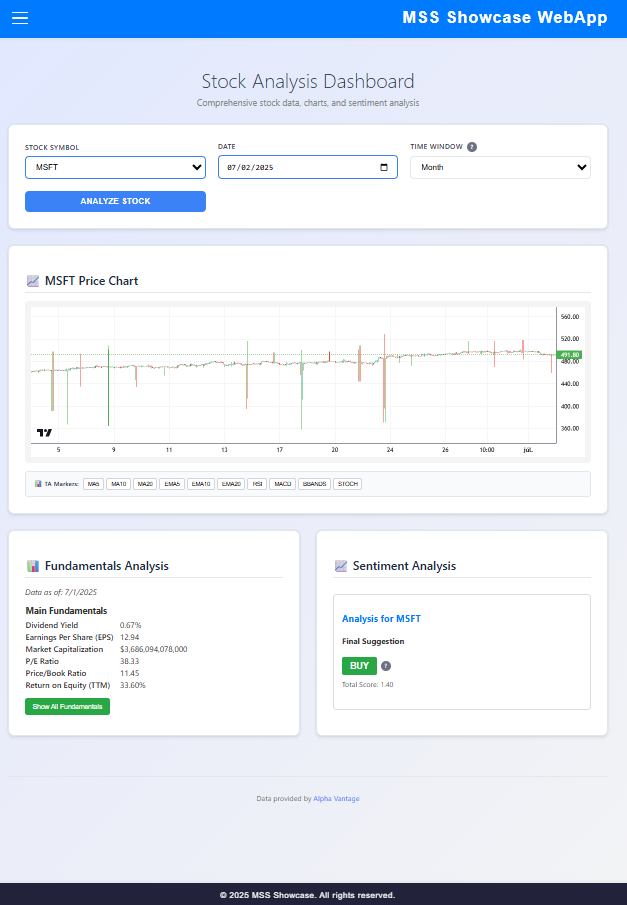
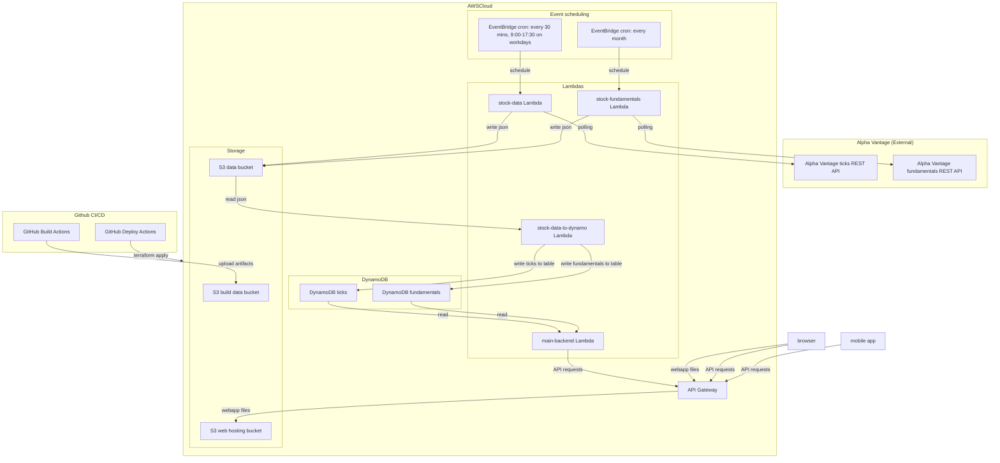

## Hi there 👋

Welcome to the MSS Showcase GitHub Organization!

🙋‍♀️ **About Us**  
We are building a modular, AWS-based microservice showcase project focused on stock market data processing and analysis. Our project demonstrates best practices using AWS Lambda, DynamoDB, S3, EventBridge, API Gateway, and modern frontend technologies like React and React Native — all carefully optimized to run within the AWS Free Tier.

🌈 **Contributing**  
We welcome contributions from the community! Whether it’s improving our Lambdas, enhancing Terraform infrastructure code, or building out frontend apps, your input helps us grow. Check our repositories for open issues and feel free to submit pull requests or open discussions.

👩‍💻 **Resources**  
- The [MSS Showcase GitHub org](https://github.com/mss-showcase) contains separate repositories for deploy scripts configured a CloudFront Distribution (but that is too complex to configure and it is too , deploy much for this showcase - therefore I will switch to s3 static web hosting)workflows, Lambda functions, and frontend apps.  
- Our infrastructure is defined via Terraform with upsert workflows.  
- The Lambdas are mostly Node.js based, with GitHub Actions automating build and deploy pipelines.  

🍿 **Fun Fact**  
Our team runs on coffee and coding snacks while crafting scalable serverless solutions!  

# A screenshot from the current frontend

# ** The current architecture **

# Where are we now?

As you can see the terraform scripts of the mss-infra project in this phase can reliably 

 * create the necessary buckets (for build and for data)
 * deploy each lambda to AWS
 * set up the correct roles, permissions and policies in AWS IAM for the lambdas
 * configure the AWS gateway
 * The webapp deployment - it required a new S3 bucket and static hosting (CloudFront configuration has been dropped for the sake of simplicity)

# TODOs

 * The mobile app - instead of the Expo app, a new mobile app will be created (technology to be decided)
