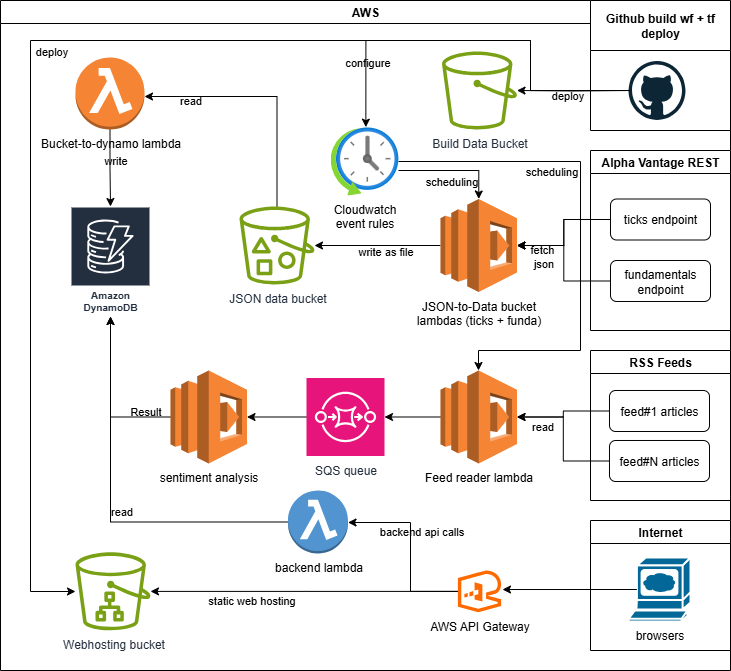

## Hi there 👋

Welcome to the MSS Showcase GitHub Organization!

### About this project
I am building a modular, AWS-based microservice showcase project focused on stock market data processing and analysis. My project demonstrates best practices using AWS Lambda, DynamoDB, S3, EventBridge, API Gateway, and modern frontend technologies like React — all carefully optimized to run within the AWS Free Tier.

The application in AWS is fetching the data from Alpha Vantage with the applicable time window (30 mins) that can keep this project in the free plan - so in case of sideways market you will see a near horizontal line, so it is not an error of the code - you have to zoom in.

To make this even funnier, I did this with (near) zero AWS, Github Action, Terraform, Node/express or React knowledge - I have been using ChatGPT and copilot with vscode for this project exclusively. At least I've learned a few things while troubleshooting :)

## Resources
- The [MSS Showcase GitHub org](https://github.com/mss-showcase) contains separate repositories for (github action + terraform) deploy scripts, configured a CloudFront Distribution (but that is too complex to configure and it is too , deploy much for this showcase - therefore I will switch to s3 static web hosting for now), Lambda functions, and a simple frontend app.
- My infrastructure is defined via Terraform with upsert workflows.
- The Lambdas are at now Node.js based, with GitHub Actions automating build and deploy pipelines.  

## A screenshot from the current frontend

## The current architecture

## Where I am now?

**Current state of the subprojects:**

- **mss-infra-core**: Provisions and manages core AWS infrastructure (S3 buckets, DynamoDB, Cloudfront web hosting) using Terraform, with automated deployment via GitHub Actions.
- **mss-infra**: Manages organization-level variables/secrets and orchestrates deployment of all Lambda functions and API Gateway, configures CloudFront and other AWS resources in a recommended order.
- **mss-stock-data-source**: Fetches stock data (ticks and fundamentals) for hard-coded tickers from Alpha Vantage, aggregates and uploads gzipped JSON to S3.
- **mss-stock-data-to-dynamo**: Lambda reads gzipped JSON from S3 and loads records into DynamoDB.
- **mss-financial-sentiment-lambda**: Two Lambdas—one collects news from RSS feeds, the other processes articles for sentiment analysis and stores results in DynamoDB.
- **mss-backend**: Node.js Lambda (Express) serving stock, fundamentals, technical analysis, and sentiment data via API Gateway. Also provides buy/sell/neutral suggestions.
- **mss-frontend**: Responsive React web frontend (Vite + Redux, monorepo) deployed to S3 static hosting. Local development and CI/CD supported via pnpm.

- **AWS Cognito and Google OAuth**: backend- and frontend level integration

> Each direct subfolder contains its own README.md with more details.

## TODOs

* User management in admin dashboard, adding and removing watched tickers
* User-related features (portfolio handling, maybe user-defined ticker data fetching).
* Admin dashboard to gain insight and manage internal operations to some extent.
* Expand analysis and prediction features by adding new perspectives and possibly generative AI-based suggestions.
* Improve frontend UX and add more visualizations and features.
* Replace the Expo mobile app with a new mobile app (technology to be decided).
* Add more tests and monitoring for all services.

## Give it a try!

You can try this webapp in AWS until approximately 2026.06.01, or until AWS starts charging for hosting—whichever comes first.

https://dgjqblpal7nk2.cloudfront.net/
